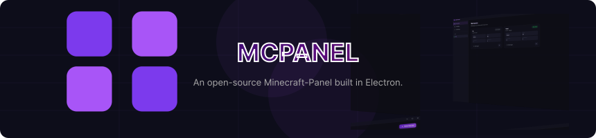

<div align="center">
  
</div>

<div align="center">

[](https://github.com/DippyCoder/MCPanel/releases)⠀
[](https://github.com/DippyCoder/MCPanel)
[](https://discord.gg/xe5BPEd6JA)
[](LICENSE)
</div>

An open-source Minecraft-Panel built in Electron. 

---

## ✨ Features

- **Multi-server management** — Run and manage multiple Minecraft servers simultaneously
- **Auto version fetching** — Live version lists from official APIs for:
  - Paper, Purpur, Leaf (PaperMC API)
  - Vanilla (Mojang launcher manifest)
  - Fabric (FabricMC meta API)
  - Velocity (PaperMC API)
  - Spigot (manual jar, BuildTools required)
- **Profiles** — Server presets with files, plugins, configs
  - Create a profile, add any files (plugins/, config/, etc.)
  - Restrict profiles to specific software or versions
  - Files are copied to the server on creation
- **Live Console** — Real-time server output with command input and history (↑↓)
- **Server Controls** — Start, Stop, Restart, Kill
- **Smart JAR detection** — Auto-uses the only `.jar` in the server folder if `server.jar` doesn't exist
- **Quick port change** — Change port from the UI, auto-updates `server.properties`
- **Java configuration** — Per-server JDK path and Java arguments
- **Status overview** — Online/offline badge, player count, port on the server cards
- **Storage tracking** — Tracks server folder size, optional storage limits
- **Theme system** — Install, browse, and swap themes without restarting
  - Browse community themes online and install in one click
  - Import any theme as a `.zip` or from a direct URL
  - Ships with **Dark Slate** (neutral dark, blue accents) and **Bright Slate** (light, blue accents)
  - Create your own themes with a simple `theme.json` + `theme.css` — see the [themes branch](https://github.com/DippyCoder/MCPanel/tree/themes)

---

## 🚀 Quick Start

### Dependencies
- [Node.js](https://nodejs.org) v18 or higher
- Java (for running Minecraft servers)

### Run from source

**Windows:**
```
double-click start.bat        ← opens console window with output
double-click start.exe        ← silent launch, no console window
```

**macOS / Linux:**
```bash
chmod +x start.sh
./start.sh
```

**Manual:**
```bash
npm install
npm start
```

### Build as executable

**Windows** — double-click `build.bat` (run as Administrator) or:
```
build.bat win       # Windows installer  →  dist/win
build.bat mac       # macOS disk image   →  dist/mac
build.bat appimage  # Linux AppImage     →  dist/linux
build.bat deb       # Linux .deb         →  dist/linux
build.bat rpm       # Linux .rpm         →  dist/linux
build.bat all       # all platforms
build.bat clean     # clear dist folder
```

**macOS / Linux** — same options via `./build.sh [target]`

Output files:
```
dist/
├── win/     ← MCPanel Setup x.x.x.exe
├── mac/     ← MCPanel-x.x.x.dmg
└── linux/   ← MCPanel-x.x.x.AppImage / .deb / .rpm
```

---

## 📦 Using Profiles

1. Go to **Profiles** → **New Profile**
2. Enter a name and optionally restrict to specific software/versions
3. Click **Open Folder** — this opens the profile's directory
4. Add any files you want (e.g. `plugins/EssentialsX.jar`, `config/`, `server.properties`)
5. When creating a server, select your profile — all files will be copied over

**Profile folder example:**
```
profiles/profile_1234567890/
├── profile.json          ← metadata (don't delete)
├── plugins/
│   ├── EssentialsX.jar
│   └── LuckPerms.jar
├── config/
│   └── essentials/
└── server.properties     ← custom server properties
```

---

## ⚙️ Java Configuration

Each server has its own Java path and arguments:
- **Java Path**: full path to `java.exe` or `java`, or just `java` if it's in PATH
- **Java Args**: JVM flags (default includes G1GC tuning for good performance)

Use **Settings → Scan for Java** to auto-detect installed JDKs.

Recommended Java arguments for large servers:
```
-XX:+UseG1GC -XX:+ParallelRefProcEnabled -XX:MaxGCPauseMillis=200 -XX:+UnlockExperimentalVMOptions -XX:+DisableExplicitGC -XX:+AlwaysPreTouch -XX:G1HeapWastePercent=5 -XX:G1MixedGCCountTarget=4
```

---

## 🎨 Themes

Themes let you reskin MCPanel without touching the source. Install them from inside the app:

**Browse online**
1. Open **Settings** → **Themes** → **Browse Online**
2. Pick a theme and click **Install**
3. Click **Apply** — takes effect immediately

**Import a ZIP**
1. Download a `.zip` theme file
2. **Settings** → **Themes** → **Import ZIP**

**Install from URL**
1. **Settings** → **Themes** → **Install from URL**
2. Paste a direct link to a `.zip`

To go back to the default look, click **Reset to Default**.

Community themes and authoring docs live on the [`themes` branch](https://github.com/DippyCoder/MCPanel/tree/themes).

---

## 🔧 Notes

- **Spigot**: Requires manual compilation via [BuildTools](https://www.spigotmc.org/wiki/buildtools/). MCPanel creates the server folder but won't download the JAR automatically.
- **Fabric**: Downloads the server-side loader JAR directly from FabricMC
- **EULA**: `eula.txt` is automatically set to `true` on server creation
- Servers data is stored in your OS user data directory and persists across app updates

---

## 🏗️ Tech Stack

| Layer | Technology |
|-------|-----------|
| Desktop shell | Electron |
| Backend | Node.js (main process) |
| Frontend | Vanilla HTML/CSS/JS |
| Fonts | Syne (display) + JetBrains Mono |
| Build | electron-builder |
